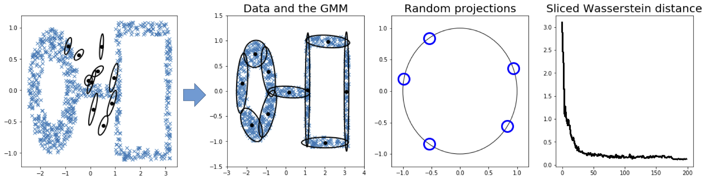

# swgmm

This repository contains a demo implementation of the method described in:

["Sliced Wasserstein Distance for Learning Gaussian Mixture Models", CVPR'18](https://arxiv.org/abs/1711.05376)

which defines the sliced-Wasserstein means problem, and describes a novel technique for fitting Gaussian Mixture Models to data. In short, the method minimizes the sliced-Wasserstein distance between the data distribution and a GMM with respect to the GMM parameters. 

